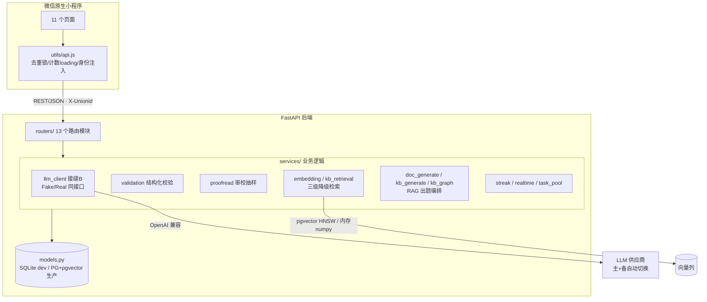

# AI 闯关学习小程序

微信原生小程序 + FastAPI 的 AI 学习产品：面向教师资格证《综合素质》备考，支持**官方题库闯关**、**上传资料跨文档 RAG 出题**、**AI 模拟答（聊天式追问评分）**三条学习链路。

- 出题主体是 AI 变式题（不存储、不展示任何真题原文），入库前经过「结构化校验 → LLM 自检 → 人工抽检」三层闸门
- 官方题库含 418 道真实感题目，覆盖考纲 150 个考点（由离线 LLM 管线生成 + 逐题审校）
- AI 模拟答走纯 LLM 路线：现场生成情境化面试题，用户自然语言作答，AI 像真面试官一样追问后按要点覆盖率评分

## 功能特性

| 链路 | 说明 |
|---|---|
| 官方题库闯关 | 五维模块/考点抽题、防相邻同题型、仿真模考（按卷面权重限时组卷、服务端绝对时间计时） |
| 资料出题（RAG） | 上传 PDF/Word/TXT/Markdown → 解析切分 → 向量化 → 单文档整卷（章节配额）或定点出题 → 个人题库 |
| AI 模拟答 | 聊天式对话：语音输入（ASR）/文字、AI 追问（引用用户原话）、要点覆盖评分、按需朗读（TTS） |
| 学习闭环 | 复盘报告（EMA 掌握度 + 薄弱考点）、错题本（按考点聚合、答对即移出、变式重练）、每日任务与连胜补签 |
| 配额体系 | 每日作答额度（超限 429 友好提示）与实时生成额度（超限自动降级池化，用户无感）两套独立限速 |

## 架构



**分层**：表现层（原生页面）→ 接口层（13 个 Router）→ 服务层（不依赖 HTTP 的业务逻辑）→ 数据层（唯一 schema 源 + Alembic）。

**LLM 接缝**是本项目的可测试性核心：所有 AI 调用收口到 `LLMClient` 抽象基类，`get_llm_client()` 是唯一切换点；`FakeLLMClient` 返回确定性产物，使全链路测试零 API 额度。

## 快速启动

### 1. 后端

```bash
cd backend
pip install -r requirements.txt

# 配置环境变量：复制 .env.example 为 .env，填入你自己的 API Key
cp .env.example .env

# 启动（默认 SQLite，自动建表）
python -m uvicorn app.main:app --host 127.0.0.1 --port 8000
```

`LLM_MODE=fake`（默认）下全功能可用且不消耗任何 API 额度；切换 `real` 接入真实模型。

### 2. 小程序

1. 微信开发者工具导入 `miniprogram-native/` 目录
2. 后端地址默认 `http://127.0.0.1:8000`（`utils/api.js` 的 `BASE` 常量，真机预览改为电脑局域网 IP）
3. 编译即可运行（游客身份自动创建）

### 3. 测试

```bash
cd backend
python -m pytest            # 全量（.env 为 real 时部分用例自动跳过）
python -m pytest tests/test_chat.py   # 单模块
```

## 项目结构

```
backend/
  app/routers/       13 个路由模块（sessions/documents/chat/admin...）
  app/services/      LLM 接缝、校验、审校、解析、检索、出题编排、连胜、线程池
  app/pipeline/      闲时批量扩池
  app/seed/          考点骨架 + 真实题库（418 题）
  app/models.py      唯一 schema 源
  alembic/           生产 PG 迁移（含 pgvector + HNSW）
  scripts/           离线题库生成管线 / 一次性入库 / HTTP 冒烟
  tests/             27 个测试文件（约 250 用例）
miniprogram-native/
  pages/             11 个页面
  utils/             api 封装 + 纯逻辑模块（各配 vitest 单测）
  app.wxss           设计令牌（低饱和、单一品牌色、统一圆角）
```

## 技术亮点

- **LLM 接缝 + Fake 实现**：AI 的不确定性收口到一个接口后，Fake/Real 同接口切换，全链路测试零额度
- **RAG 出题不欠产工程**：小批次（实测 6→3）+ 多生成候选再截断 + 阈值放宽重试 + 降粒度重试 + 最大余数法章节配额
- **三级检索降级**：向量 → 关键词（中文二元组）→ 均匀采样；跨文档用 RRF 融合 + 章节标题加权；PG 走 pgvector HNSW、SQLite 走内存 numpy，双库自动分发
- **溯源防幻觉**：模型回传的切片 id 必须落在本次召回集合内才采信，否则回退批级清单
- **Fail-open / Fail-close 分级**：评分与内容安全绝不静默放行；embedding、自检、检索可降级不阻塞
- **判重**：题干归一化精确层 + 字符 3-gram Jaccard 近似层（阈值按场景 0.6/0.85 分路线）
- **协作式取消**：出题任务只在批次边界检查取消，已生成题目作为部分卷保留
- **对话状态机**：追问式评分三态（提示/追问/终评），补充轮次上限防死循环，离题有出口，会话可恢复

## 说明

- `backend/app/services/kb_generate.py`、`kb_graph.py` 是跨文档出题的两条实验路线（手写闭环 / LangGraph 编排），与生产链路共享检索与校验接缝，其中 `kb_generate` 的降粒度重试被单文档出线的补偿轮复用
- 生产部署切换 `DATABASE_URL` 至 PostgreSQL 即启用 pgvector 向量检索与 Alembic 迁移
- License：MIT
