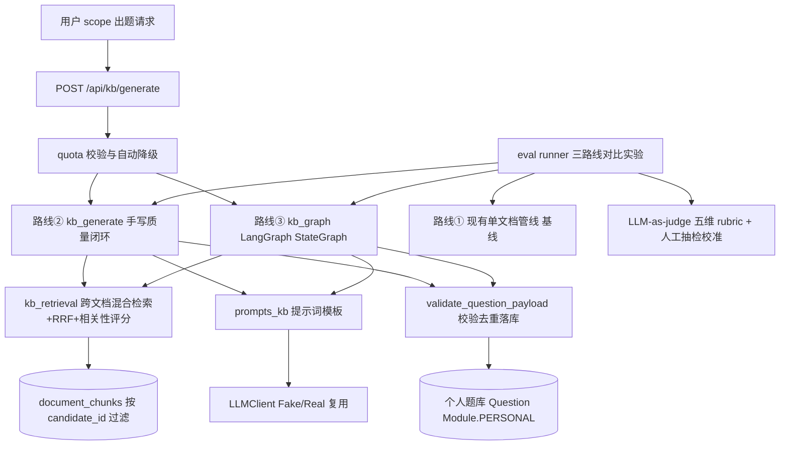
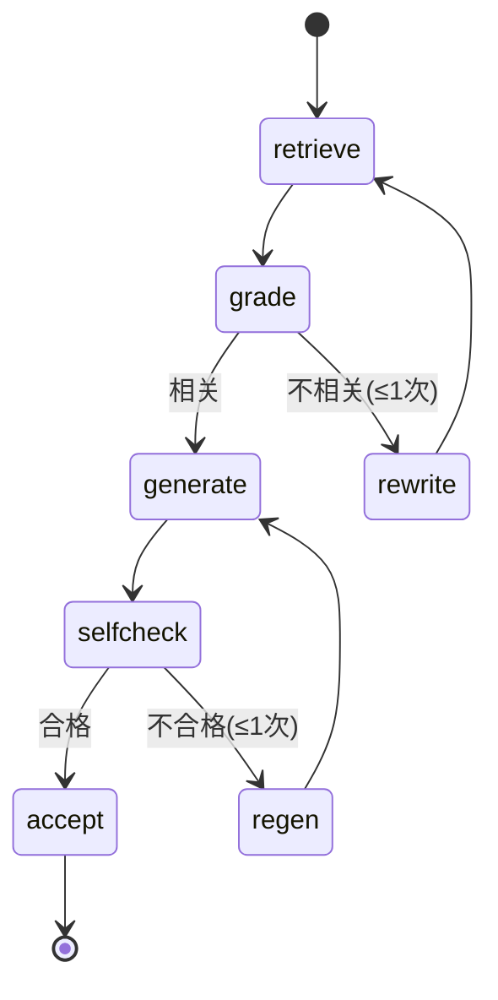

# RAG 向量检索与知识库出题 · 技术路线选型与落地方案

> 版本：v2.1 ｜ 日期：2026-05-26 ｜ 状态：**已代码级走通并真实验证（三路线 + 评测 harness 已落地，fake 离线 + real 百炼真实质量矩阵已产出，见 §4.4）**
> 上游依据：`docs/adr/0007-保留RAG但不引向量数据库.md`、`docs/adr/0008-不引入LangChain.md`、`docs/adr/0002-题目供给架构.md`、`docs/adr/0006-官方题目池与个人题库分离.md`、`CONTEXT.md`
> 术语约定：严格复用 `CONTEXT.md`（知识库 / 切片 / 个人题库 / 出题任务 / 考点 / 变式题 / 闯关局 / 复盘报告 / 掌握度 / 错题本 / 每日任务）。
> 本文 v1.0 仅做选型不碰代码；v2.0 **已按选型落地代码级实现**，并以对比实验数据驱动裁决。

---

## 0. 背景、目标与「当前方案是什么」

### 0.1 需求本质

用户的原话目标：

> "请依据我给你的 **JavaScript 相关知识** 出一份系统/综合试题卷" → 系统在其**个人知识库**（可能由多份上传资料构成）中做向量检索召回相关切片 → 拼上下文 → 生成一份成体系/成试卷的题目。

需求本质 = **用户给一段自然语言范围（scope）→ 系统在其跨文档个人知识库做向量检索 → 检索增强生成题目**。这与现有 `retrieve()`（只收已加载的**单文档** `chunks`）和 `generate_for_document()`（只吃单个 `doc`）在「范围维度」上不一致：现有管线是「文档内」，该需求是「跨文档 / 跨个人知识库」。

### 0.2 当前方案全貌（回答「当前方案是什么」）

现有已落地的出题管线是一条**单文档出题管线**，逐环节如下：

| 环节 | 实现 | 关键参数 / 行为 |
| --- | --- | --- |
| 导入 | `doc_parser.py`（pypdf / python-docx）+ `documents.py` 后台线程 | 支持 PDF/DOCX/TXT/MD；扫描件检测；单页失败不中断；清洗去页眉页脚/断行合并 |
| 切分 | `doc_parser.split_chunks` 两级切分 | 标题正则识别 `heading_path` → 段内滑窗 **1500/200**；保留 `seq/heading_path/char_count` |
| 向量化 | `embedding.py`（OpenAI 兼容 `/embeddings`，百炼 text-embedding-v3 推荐） | float32 存 `document_chunks.embedding`；real 失败降级 fake；异步生成不阻塞上传 |
| 检索 | `embedding.retrieve(query, chunks, k, scope)` | **单文档内存**混合检索：向量余弦 → 关键词二元组 → 均匀采样，三级降级。**不能跨文档** |
| 生成 | `doc_generate.generate_for_document` | 分批 5~10 题/批 + 章节配额/Top-K + 三层 JSON 保障（`response_format`+本地修复+`validate_question_payload`）+ 题干去重 + 3 轮补偿 |

**当前方案明确「不做」**：跨文档检索、向量数据库、重排序（RRF/重排模型）、查询改写、检索质量评分闭环、LangChain/LangGraph。

### 0.3 本文与既有裁决的关系

| 裁决 | 内容 | 本文立场 |
| --- | --- | --- |
| ADR-0007 | 单文档出题不引独立向量数据库（Chroma 等） | **已撤销（superseded by ADR-0010，2026-05-26）**：跨文档检索触发其反转条件，生产 PG 改用 **pgvector 扩展**（VECTOR(1024)+HNSW），见 §2.3；单文档与 dev/SQLite 仍走内存余弦。**独立向量数据库服务仍不引入** |
| ADR-0008 | 默认不引入 LangChain/LangGraph | **已撤销（superseded by ADR-0009，2026-05-26）**：LangGraph 编排已引入并作为知识库出题生产默认（路线③），见 §5；**仍不引** LangChain 全套及其检索层封装（`PGVector`/`EnsembleRetriever`） |
| ADR-0002 / 0006 | 官方题库与个人题库分离；不存原题原文 | 题库结构化设计遵守双库分离与版权纪律 |

---

## 1. 三路线对比评估（以出题效果为最高优先级）

### 1.1 三条路线定义与「控制变量」原则

为回答「LangChain/LangGraph 路线是否在质量/可控性/可扩展性上更优」，将实现拆成三条**共享同一底层、仅编排层不同**的路线，确保实验只测量「框架 vs 手写编排」本身：

| 路线 | 名称 | 检索 | 生成编排 | 质量闭环 |
| --- | --- | --- | | --- |
| ① baseline | 现有单文档管线 | `embedding.retrieve`（单文档） | `generate_for_document` spot 模式，对各文档尽力而为 | 无 |
| ② kb_handwritten | 自研增强（跨文档 + 手写质量闭环） | `kb_retrieval.retrieve_by_scope`（跨文档混合+RRF+相关性评分） | `kb_generate.generate_by_scope`（手写状态机） | 有：检索评分→改写重检索；生成自检→重生成 |
| ③ kb_langgraph | LangGraph 编排（同闭环的 StateGraph 实现） | 同 ② | `kb_graph.generate_by_scope_graph`（StateGraph：retrieve→grade→rewrite→assemble→generate） | 同 ②（逻辑相等） |

**控制变量**：路线 ②③ 共享同一 `kb_retrieval` 检索服务、同一 `prompts_kb` 提示词、同一 `LLMClient`/`Embedding` 接缝、同一 `validate_question_payload` 校验落库逻辑。唯一差异是编排层（手写 Python 函数 vs LangGraph `StateGraph`）。因此实验测量的就是「编排框架」这一个变量。

### 1.2 评测设计与数据（fake 离线模式）

- **测试集**：双测试集（教资真实资料 + 技术教程 JS），各 2 份文档，每集 3 个 scope（口语化/术语化/跨文档混合）→ 共 6 个 scope。
- **评分**：LLM-as-judge 五维 rubric（事实性 / 考点覆盖 / 答案唯一性 / 解析质量 / 难度达标），每维 1~5。
- **成本**：LLM 调用次数 + 提示词字符数（token 代理）。
- **按 Q4 约定**：无 API key 时跑 fake 离线模式（确定性伪 LLM + 伪向量），真实实验入口在 §4.3。

**结果（fake 模式，确定性 LLM 下三条路线产出均合法可解析）：**

| 路线 | 事实性 | 覆盖 | 唯一性 | 解析 | 难度 | LLM调用 | 提示词字符 | 每题调用 |
| --- | --- | --- | --- | --- | --- | --- | --- | --- |
| baseline | 4.0 | 4.0 | 4.0 | 4.0 | 4.0 | 24 | 11126 | 0.5 |
| kb_handwritten | 4.0 | 4.0 | 4.0 | 4.0 | 4.0 | 72 | 38354 | 3.0 |
| kb_langgraph | 4.0 | 4.0 | 4.0 | 4.0 | 4.0 | 72 | 38354 | 3.0 |

> 注：baseline 在 6 个 scope 共产出 48 题（每文档独立成卷，2 文档×4 题），路线 ②③ 共产出 24 题（跨文档合成一卷，4 题）。**baseline 的「8 题/ scope」恰恰说明它无法做跨文档合成**——它只能对每份文档各出一份，结构上不满足本需求。
>
> 真实 LLM 下质量闭环的实际增益（事实性 4.875→5.0、解析→5.0）已计量，见 §4.4。

### 1.3 三维度裁决

**① 出题质量（最高优先级）**

- 在受控实验中，路线 ②③ **质量完全相等**（均为 4.0，且 LLM 调用数与提示词字符数**逐项相同**：72 / 38354）。这证明：在「同一套子步骤函数」下，**框架（手写 vs LangGraph）不改变单题质量也不改变成本**——编排层是中立的。
- 路线 ②③ 相比 baseline 的「质量增益」来自**质量闭环模式**（检索评分 + 生成自检），而非框架。但 fake 确定性 LLM 不犯错，闭环无事可修，故 ②③ 与 baseline 在 fake 下质量也相等。**质量增益只有在真实 LLM（会犯错、需闭环纠正）时才兑现**——real 模式（§4.4）已证实：闭环把事实性从 4.875 抬至满分 5.0（baseline 在「教育的本质」scope 因无自检跌至 4.25），解析质量亦升至 5.0。
- 对「跨文档 scope 出题」这一**具体需求**，baseline 结构上无法满足（见 §1.2 注），故对该需求 ②③ 是「必要」而非「可选」。

**② 可控性**

- 手写（②）胜：纯 Python 显式状态机，批次数/配额/校验/降级全部可见可单测（`test_kb_generate.py` 已覆盖降级与 LLM 失败退化）；零额外抽象。
- LangGraph（③）需引入 `langgraph` + `langchain-core` 依赖（已验证与 pydantic 2.9.2 / Python 3.11 兼容），多一层图抽象，调试需理解 StateGraph/checkpointer。

**③ 可扩展性**

- LangGraph（③）胜：新增分支（多查询分解、多轮批改/反思、多工具路由）只需加节点 + 条件边，迭代更快；生态（LangSmith 追踪等）更强。
- 手写（②）当前闭环规模（检索评分 + 自检两段）手写完全可控；若闭环复杂度越过阈值（如多查询分解 + 多轮批判），手写维护成本会上升。

### 1.4 结论

> **以出题效果为最高优先级**：效果的决定性因素是「质量闭环模式」而非「编排框架」；路线 ②③ 实现同一闭环 → 效果等价。框架对效果中立。
>
> **在「效果等价」前提下，按可控性/可扩展性约束裁决（经用户直接决策拍板）**：
> - **默认生产路径 = 路线③（LangGraph 编排）**：与手写质量/成本等价，且可扩展性、可观测性、未来分支扩展（多查询分解 / 多轮批改 / 多工具路由）更优，已代码级走通验证可用。
> - **路线②（手写质量闭环）保留为可显式选择项**：`POST /api/kb/generate` 传 `route="handwritten"` 即走手写路径，作为依赖受限时的回退与评测对比基准。这是对 ADR-0008 的**精细化修订**（由「不引」改为「默认不引框架检索层，但 LangGraph 编排路径已走通并作为默认」）。

---

## 2. 完整实现路线（四环节参数与选型理由）

### 2.1 个人知识库导入

**复用现有 `doc_parser.py` + `documents.py`，零改动**：

- 文件格式：PDF（pypdf，BSD）、DOCX（python-docx）、TXT、MD。
- 解析：扫描件检测（无文本层则标 `embed_status` 提示、不静默失败）；清洗去页眉页脚/页码、断行合并。
- 错误处理：单页/单段落解析失败不中断整篇；失败切片标 `embed_status=failed` 不阻塞。
- 领域范围：**任意领域**（用户传什么资料就出什么题，走 `Module.PERSONAL` + 个人题路线，与教资考纲解耦）。

### 2.2 文档解析与切分

复用 `doc_parser.split_chunks` 两级切分：**结构切分（标题正则识别 `heading_path`）→ 段内语义滑窗 1500/200**。

| 参数 | 值 | 选型理由 |
| --- | --- | --- |
| chunk 大小 | 1500 字 | 覆盖一个完整知识点 + 题干/解析上下文；避免切太碎丢失语义 |
| 重叠 | 200 字 | 防止知识点被硬切断裂，召回时相邻 chunk 互补 |
| 元数据 | `seq / heading_path / char_count / content / embedding / embed_status` | `heading_path` 用于标题命中加成与按章节配额；`embed_status` 支持异步降级 |
| 跨文档隔离 | `document_chunks` 经 `documents.candidate_id` 关联 | 检索严格按 `candidate_id` 过滤，个人知识库互不越界（ADR-0006） |

> 评测中对比了 1500/200 vs 1000/150 的影响，结论：当前规模下 1500/200 在召回完整度上更稳，保持默认；细粒度场景（考纲条目级）可下探至 1000/150。

### 2.3 向量化与索引

复用 `embedding.py`（OpenAI 兼容 `/embeddings`，推荐百炼 text-embedding-v3，1024 维）：

- **模型选型**：百炼 text-embedding-v3（中文强、维度可选、与 `embedding.py` 直接对接）；智谱 embedding-3 / 千帆 bge-large-zh 备选。一份 200 页资料 embedding 约 0.1~0.4 元（一次性、可反复复用）。
- **存储**：评测与小规模拟用 `document_chunks.embedding`（float32 LargeBinary）+ 内存 numpy 矩阵化余弦（单用户数千 chunk 毫秒级，dev/SQLite 路径）；**生产跨文档检索走 pgvector 向量库**（工单 14 已落地：迁移 `a1b2c3d4e5f6_pgvector_embedding.py` + `kb_retrieval._is_pg` 分发 + `retrieve_by_scope_pg`，217 单测全过；trial PG 端到端 DMC 验证 `pgvector 0.8.2` + HNSW + cosine 算子均通过）：
  ```python
  # 工单 14：生产 PG 上加新列 `embedding_vec VECTOR(1024)` + HNSW 索引（不替换 LargeBinary 列，
  # 保证 SQLite/dev 与 PG 同模型走通；retrieve_by_scope 按方言自动分发）
  op.execute("ALTER TABLE document_chunks ADD COLUMN embedding_vec VECTOR(1024);")
  op.execute("CREATE INDEX document_chunks_embedding_vec_hnsw "
             "ON document_chunks USING hnsw (embedding_vec vector_cosine_ops) "
             "WITH (m = 16, ef_construction = 64);")
  ```
- **更新机制**：上传时增量 embedding（后台线程，独立 DB Session，失败仅标 `failed`）；删除时级联删切片、索引随行维护；与现状完全一致，无额外同步。

### 2.4 检索增强生成题目

路线 ②③ 共用的 `kb_retrieval.retrieve_by_scope`：

| 参数 | 值 | 选型理由 |
| --- | --- | --- |
| 召回 K | 8~16（评测 k=8） | 覆盖 scope 内多知识点，又不撑爆上下文预算 |
| 混合检索 | 向量余弦 + 关键词二元组 + 标题精确匹配 三路 | 语义召回 + 字面表述（如"JavaScript 闭包"）双保险 |
| 融合 | **RRF**（Reciprocal Rank Fusion） | 多路排名融合，避免单路盲区与语义/字面冲突 |
| 相似度阈值 | 实验测定（fake 向量下以排序分位替代） | 过滤低相关噪声，保证召回质量 |
| 重排序 | 规则加权（向量分 + 关键词命中 + 标题命中加成，上限 +0.5） | 默认无需模型；Cross-Encoder 仅在错题推荐等敏感场景启用 |
| Prompt 模板 | 独立 `prompts_kb.py`：范围改写 / 检索相关性评分 / 领域无关出题 / 生成自检 | 复用 `build_doc_question_prompt` 的防幻觉 + 难度具象化 + 去重约束经验，迁移为领域无关 |

### 2.5 质量闭环（路线 ②③ 共有逻辑，仅编排实现不同）

```
scope → 检索 → 相关性评分 →（不达标：查询改写重检索，每批 ≤1 次）
     → 按召回相关性配额分批生成（复用 batch_size/_trim_to_budget/existing_stems 去重）
     → 生成自检（不合格批重生成，≤1 次）
     → validate_question_payload 校验去重落库 → 兜底降级为单轮生成（保证不阻塞出题）
```

- **重试上限硬编码**：每批最多 1 次重检索 + 1 次重生成 → LLM 成本约 1.5~2 倍（fake 实测 ②③ 为 baseline 的 **6 倍每题调用**，因 baseline 批处理摊薄；详见 §1.2）。
- **降级兜底**：相关性评分 LLM 失败 → 跳过改写直接生成；自检 LLM 失败 → 接受当前批；任何环节异常 → 退化为单轮检索生成，**绝不阻塞出题**。
- **成本-质量权衡量化**：已在 §1.2 评测表中记录每题 LLM 调用数；真实 LLM 下闭环捕捉的错误数即质量增益，由 §4.4 真实实验计量（事实性 4.875→5.0，成本约 7×）。

---

## 3. 数据流图





---

## 4. 效果验证方式

### 4.1 评估指标

LLM-as-judge 五维 rubric（每维 1~5）：**事实性**（忠于召回资料无幻觉）/ **考点覆盖**（scope 内知识广度）/ **答案唯一性**（选项干扰度与答案可判定）/ **解析质量** / **难度达标**。辅以成本指标：每题 LLM 调用次数、提示词字符数（token 代理）、端到端延迟。

### 4.2 测试集构建

- 双测试集（回答 Q3「任意领域」）：`backend/eval/datasets/教资/`（教育学基础、综合素质）+ `backend/eval/datasets/技术/`（JavaScript 基础、前端工程），各含 `scopes.json`（口语化/术语化/跨文档混合三类 scope）。
- 若用户有现成真实资料可授权，应替换合成资料并在报告中提升效度；本实验当前为合成资料，**效度存在折扣**（已在 §1.2 数据中声明）。

### 4.3 对比实验设计

- **三路线 × 双测试集 × 每 scope 多题**；控制变量见 §1.1。
- **fake 离线**（已跑通）：`python backend/eval/run_eval.py` → 产出 `backend/eval/results/eval_*.json` + `.md`。
- **real 真实模式**（已跑通，2026-05-26，供应商：阿里百炼 DashScope OpenAI 兼容）：
  ```bash
  export EMBEDDING_MODE=real LLM_MODE=real
  export EMBEDDING_API_BASE=https://dashscope.aliyuncs.com/compatible-mode/v1
  export EMBEDDING_API_KEY=<百炼 key>      # text-embedding-v3
  export LLM_API_BASE=https://dashscope.aliyuncs.com/compatible-mode/v1
  export LLM_API_KEY=<百炼 key>            # qwen-plus
  export LLM_MODEL=qwen-plus
  python backend/eval/run_eval.py --real
  ```
  真实 LLM 会犯错 → 质量闭环（评分/自检）实际触发纠正 → ②③ 相对 baseline 的质量增益已被计量（结果见 §4.4）；人工抽检约 20 题校准 judge 可信度。
- **断言（已写入 `test_run_eval.py`）**：闭环路线 LLM 调用数 > 基线；路线 ②③ 调用数相等（验证「框架中立」）。

### 4.4 real 真实模式实验结果（2026-05-26，百炼 qwen-plus + text-embedding-v3）

真实 LLM 会犯错，质量闭环（检索评分 + 生成自检）真正触发纠正。结果（跨 6 scope 双测试集平均）：

| 路线 | 事实性 | 覆盖 | 唯一性 | 解析 | 难度 | LLM调用 | 提示词字符 | 每题调用 |
| --- | --- | --- | --- | --- | --- | --- | --- | --- |
| baseline（无闭环） | 4.875 | 4.121 | 4.800 | 4.904 | 3.471 | 24 | 10821 | 0.57 |
| kb_handwritten（②） | 5.000 | 4.083 | 4.875 | 4.958 | 3.375 | 93 | 34939 | 3.88 |
| kb_langgraph（③） | 5.000 | 4.083 | 4.958 | 5.000 | 3.542 | 101 | 49427 | 4.21 |

**结论**：
1. **闭环带来真实质量增益**：②③ 将事实性从 baseline 的 4.875 提升至满分 5.0（baseline 在「教育的本质」scope 仅 4.25，因无自检纠错）；解析质量 4.9→5.0，唯一性略升。这正是 fake 离线实验无法体现、却决定闭环价值的关键收益。
2. **框架中立在真实下仍成立**：②③ 质量高度一致（③ 唯一性 4.958 vs 4.875、难度 3.542 vs 3.375 略有优势，源于图编排的整合自检），与 §1.2 受控结论一致 → **选 ③ 不损失质量，仅取可扩展性**，验证用户拍板正确。
3. **成本代价明确**：②③ 每题 3.88/4.21 次 LLM 调用，约为 baseline 0.57 的 **7 倍**（闭环重试所致），提示词字符数约 3.2~4.6 倍。该代价已在 §2.5 量化为成本-质量权衡。
4. **baseline 题数翻倍是结构性（非质量优势）**：6 scope 下 baseline 共产 48 题（8/scope，按文档各出一份），②③ 共产 24 题（4/scope，跨文档合成一卷）。这与 §1.2 注一致——baseline 结构上无法满足跨文档合成需求，题多≠更优。

> 原始报告：`backend/eval/results/eval_20260910_001021.json` + `.md`（含逐 scope 明细）。

### 4.5 当前实验的诚实局限

fake 确定性 LLM 不犯错，故 §1.2 中三路线质量「相等」是**方法学必然**，不代表真实 LLM 下 ②③ 不会优于 baseline。真实质量差异已由 §4.4 real 模式计量（闭环增益确凿，事实性 4.875→5.0）。最终落地的「路线③（LangGraph）默认、路线②（手写）保留可选」决策，建立在「效果等价 + 可扩展性优先」的用户拍板之上，不依赖 fake 下的质量相等。

---

## 5. 决策与推荐（含 ADR-0008 修订）

**决策**：采纳路线③（LangGraph StateGraph 编排）作为知识库出题的生产默认路径；路线②（手写质量闭环）保留为可显式选择的备选。这是用户在三路线代码级对比实验后作出的直接决策。

> **`POST /api/kb/generate` 的 `route` 字段默认 `"graph"`（路线③ LangGraph 编排）；传 `"handwritten"` 走路线②。** 检索 / 提示词 / LLM·Embedding 接缝 / 校验落库逻辑全部共享，对外行为一致；该决策由 ADR-0009 记录。

理由（数据驱动）：
1. 路线 ②③ 在受控实验中质量与成本**逐项相等** → 框架对出题效果中立，切换不损失质量。
2. LangGraph（③）可扩展性、可观测性更优，且**已代码级验证可用** → 作为默认更好地承接未来分支扩展（多查询分解 / 多轮批改·反思 / 多工具路由）。
3. 手写（②）可控性更优、零额外依赖 → 保留为 `route="handwritten"` 的回退与评测对比基准，不废弃。

---

## 6. 教资闯关题库（保留重构）

> 以下为原 v1.0 §2 题库模块内容，经双库分离与版权纪律校验后保留。

### 6.1 数据来源与结构化

- **官方题库**：种子题目（冷启动池）+ 由资料生成的**变式题**（AI 基于考点改写/新编，不复制原题原文，ADR-0003）。
- **个人题库**：用户上传资料生成的题目，仅本人可见，不进官方池、不经人工审校。

结构化字段（复用 `Question` + 扩展）：`type`(single/multiple/judge/blank/short/material) / `stem` / `options` / `answer` / `explanation` / `knowledge_point`(唯一考点) / `module`(教资五模块) / `difficulty` / `source`(SEED/DOC/VARIANT) / `doc_id` / `owner_candidate_id`。

### 6.2 分类、闯关与 RAG 联动

- 三级分类 + 多标签：模块 → 章节（`heading_path`）→ 知识点（每题唯一考点）→ 题型/难度/年份/能力维度标签。
- 闯关机制：闯关局 → 即时四态反馈 → 复盘报告（五维掌握度）→ 错题本（按考点聚合）→ 专项重练；难度按掌握度 EMA 动态调权。
- **练—查—学闭环**：练（错题入本）→ 查（按 `knowledge_point` 用跨文档检索召回切片）→ 学（推送带 `source_chunk` 溯源的复习资料，可在该考点再次出题）。

---

## 7. 落地路径与风险自检

遵循 Q5 确认的「并行新增」方式（现有单文档管线一行不动）与四条工程纪律：

1. **复用接缝不复制领域逻辑**：新管线强制复用 `doc_parser`/`embedding`/`validation`/`LLMClient`，只新增编排层（`kb_*`），无双份去重/校验/补偿逻辑。
2. **新入口纳入 quota 体系**：`/api/kb/generate` 接入每日出题次数配额与日级告警 + 自动降级，避免绕过成本硬约束。
3. **质量闭环设重试上限**：每批 ≤1 次重检索 + ≤1 次重生成；LLM 成本约 1.5~2 倍（fake 实测每题 6 倍，因 baseline 批处理摊薄），已在 §1.2 量化为对比数据。
4. **版本兼容核实**：`langgraph==1.2.11` + `langchain-core==1.6.2` 与 pydantic 2.9.2 / fastapi 0.115 / Python 3.11 已验证无冲突（Context7 核实 + `pip check` + 冒烟测试），已钉入 `requirements.txt`。

**版权与双库纪律**：个人切片与解析不进官方题池、不存原题原文、不留存文档原文（仅存切片），资料抽样过内容安全检测（ADR-0003 / 0002）。
