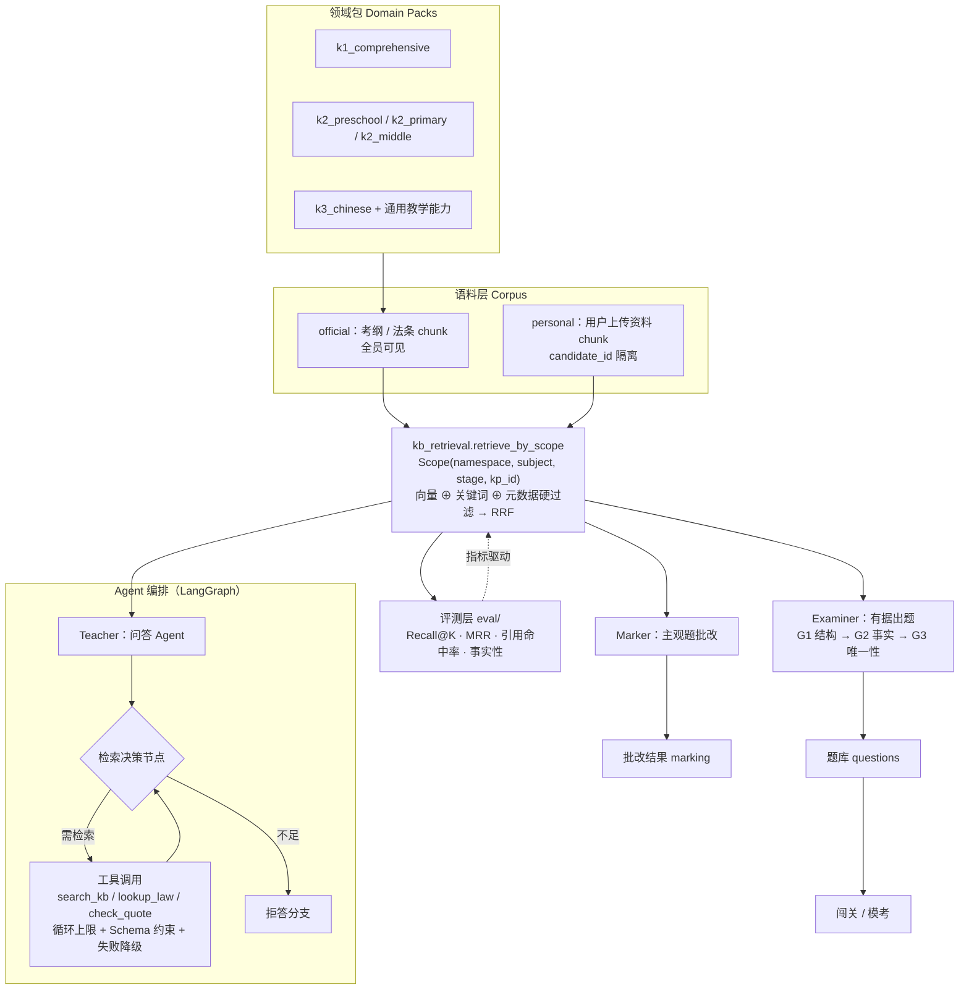
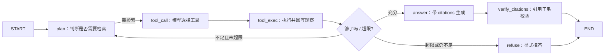

# 优师通 · 教资备考垂直领域 AI 应用项目计划书

> **版本**：v3.0（重构版）
> **日期**：2026-06-08
> **状态**：现行。本文与旧文档冲突时以本文为准。
> **上游依据**：`docs/用户需求文档.md` v2.0（**现行权威需求口径**）、`docs/技术深度文档.md`、`docs/adr/`
> **本次重构的核心动作**：废止 v2 的「三科全学段铺量」路线，改为
> **「全学段覆盖 + 科目一做深 + 打通完整 RAG/Agent 链路」**

---

## 0. 摘要

### 0.1 一句话定位

> **以领域结构（考纲 / 知识点树 / 题型 / 分值）为骨架的 Compound AI System，
> 通过可插拔领域包横向覆盖科目 × 学段。**

### 0.2 三条主线（全文所有章节都回扣这三条）

| 主线 | 内容 | 本文体现处 |
| --- | --- | --- |
| **垂直专业性** | 官方考纲结构、五大模块、分值权重、官方题型、教育法条、判分口径、免试认定政策 | §1.3 §2 §4 §6 §7 |
| **AI 能力** | RAG 三形态（QA / Generation / Evaluation）、Agent 编排、工具调用、质量闸门、rubric-grounded 批改 | §3 §5 §6 §7 |
| **两者互为骨架** | 领域 schema 即检索索引；AI 输出必须落在领域 schema 内；领域指标即 AI 指标 | §7 |

### 0.3 与 v2 路线的差异

| 维度 | v2 路线（废止） | 本计划书路线 |
| --- | --- | --- |
| 科目范围 | 三科并行铺量 | **科目一做深**（覆盖 48% 卷面的「基本能力」+ 34% 的职理/德规/法规），科目二**仅中学版本** |
| 学段范围 | 综合素质「各学段通考」 | **全学段分开**（101 / 201 / 301 分卷命题），科目一全学段覆盖 |
| 出题重心 | 客观题生成（RAG for Generation） | **主观题批改（RAG for Evaluation）**，客观题降为维持 |
| 语料重心 | 考纲 + 法条 | 考纲 + 法条 **+ 写作 / 材料分析 / 教学设计 rubric** |
| AI 形态 | 单次检索 + 单次生成 | **Compound AI System**：检索 ⊕ 编排 ⊕ 校验 ⊕ 投票 ⊕ 降级 |
| 可证伪性 | 无评测指标 | **评测先行**，全链路指标基线 → 目标 |

---

## 1. 项目定位与垂直领域说明

### 1.1 垂直领域锁定

垂直领域锁定为**中小学教师资格考试（NTCE）备考**，覆盖**笔试与面试全流程**。

选择这个领域的理由（都是可验证的领域特征，不是偏好）：

| 特征 | 含义 |
| --- | --- |
| **考纲封闭** | 考试大纲由考试院发布，模块与考点边界清晰，不存在「范围无限」问题 |
| **口径权威** | 科目设置、分值结构、合格线、有效期均有官方规定，产品可以「据实说话」 |
| **有客观判分依据** | 材料分析、写作有官方或公认的评分标准（rubric），批改不是纯主观 |
| **有法条原文** | 教育法律法规类考点直接对应法条原文，可做零误判的引用校验 |
| **有明确的备考路径** | 官方备考指南给出「六步备考建议」，产品路径可以对齐官方而非自创 |

### 1.2 定位主张

> ### 只练要考的，句句有出处

两层含义，缺一不可：

**① 「只练要考的」= 把有限复习时间转化为卷面分**

用户的时间是稀缺资源，而考纲各模块的分值权重差异极大（科目一最高 48%，最低 10%）。
产品必须回答「这 3 小时该背哪块」，而不是给一个平等的题海。

**② 「句句有出处」= 所有 AI 输出可回溯到官方原文**

用户备考的容错率极低：一条编造的法条、一个错误的判分口径，
代价是考试失分乃至信任崩塌。故 AI 的每一条结论都必须带可验证的出处。

### 1.3 领域专业性锚点

以下为**全局口径**，产品内任何数据、文案、提示词与本表冲突时，以本表为准。

#### 1.3.1 科目设置【官方】

| 报考类别 | 科目一 | 科目二 | 科目三 | 笔试科数 |
| --- | --- | --- | --- | --- |
| 幼儿园 | 综合素质（**101**） | 保教知识与能力（102） | —— | 2 科 |
| 小学 | 综合素质（**201**） | 教育教学知识与能力（202） | —— | 2 科 |
| 初级中学 | 综合素质（**301**） | 教育知识与能力（302） | 学科知识与教学能力（15 学科） | 3 科 |
| 高级中学 | 综合素质（**301**） | 教育知识与能力（302） | 学科知识与教学能力（14 学科） | 3 科 |
| 中职文化课 | 综合素质（**301**） | 教育知识与能力（302） | 比照高中 | 3 科 |
| 中职专业课 / 实习指导 | 综合素质（**301**） | 教育知识与能力（302） | 不笔试，面试考查 | 2 科 |

两条**必须写进数据模型**的结论：

1. **综合素质分学段命题**，科目代码不同（101 / 201 / 301）→ 题目必须标注学段
2. **科目二名称随学段变化** —— 幼儿园「保教知识与能力」、小学「教育教学知识与能力」、中学「教育知识与能力」
   → 领域模型必须是「科目序号 × 学段 → 科目名称」，单一常量 `教育知识与能力` 属**错误数据**

#### 1.3.2 科目二模块对照（三个版本，模块数不同）【官方】

| 幼儿园《保教知识与能力》（7 模块） | 小学《教育教学知识与能力》（7 模块） | 中学《教育知识与能力》（8 模块） |
| --- | --- | --- |
| 学前儿童发展 | 教育基础 | 教育基础知识和基本原理 |
| 学前教育原理 | 学生指导 | 中学课程 |
| 生活指导 | 班级管理 | 中学教学 |
| 环境创设 | 学科知识 | 中学生学习心理 |
| 游戏活动的指导 | 教学设计 | 中学生发展心理 |
| 教育活动的组织与实施 | 教学实施 | 中学生心理辅导 |
| 教育评价 | 教学评价 | 中学德育 |
| | | 中学班级管理与教师心理 |

> 模块数 7 / 7 / 8 不相等 —— 这直接否证了「一套科目树覆盖三科」的设计。

#### 1.3.3 科目一《综合素质》五大模块与权重【官方】

| 模块 | 主要内容 | 模块权重 |
| --- | --- | --- |
| 职业理念（教育观·学生观·教师观） | 素质教育内涵、「以人为本」学生观、新课改教师角色转变 | 15% |
| 教育法律法规 | 教育法 / 义务教育法 / 教师法 / 未成年人保护法 / 预防未成年人犯罪法 / 学生伤害事故处理办法；教师权利义务、依法执教 | 10% |
| 教师职业道德规范 | 爱国守法、爱岗敬业、关爱学生、教书育人、为人师表、终身学习 | 15% |
| 文化素养 | 历史、科技、传统文化、文学艺术常识；**范围广但考查较浅** | 12% |
| 基本能力 | 阅读理解、逻辑思维、信息处理、**写作** | **48%** |

#### 1.3.4 科目一分值结构【二手，与官方题型表一致】

| 题型 | 分值 | 占比 |
| --- | --- | --- |
| 单项选择题 | 58 分 | 39% |
| 材料（案例）分析题 | 42 分 | 28% |
| 写作题 | **50 分** | **33%** |
| **合计** | **150 分（卷面）** | 100% |

#### 1.3.5 题型、时长与合格线【官方】

- 笔试每科 **120 分钟**；卷面满分 150，折算为**报告分满分 120**，**报告分 70 分合格**
- 主观题官方题型：简答、论述、辨析、解答、材料（案例）分析、课例点评、诊断、**教学设计**、活动设计（幼儿园）、**写作**
- 面试流程：抽题 → **备课 20 分钟** → 回答规定问题 → **试讲** → 答辩；面试只报「合格 / 不合格」

#### 1.3.6 报考与认定规则【官方】

| 事项 | 规则 |
| --- | --- |
| 考试次数 | 每年上、下半年各一次 |
| 笔试成绩 | **单科有效期 2 年** |
| 面试报名 | 须笔试**全部科目合格**且成绩在有效期内 |
| 合格证明 | 笔面全合格后取得，**有效期 3 年** |
| 普通话 | 二乙及以上；语文、幼儿园等通常要求**二甲** |
| 音体美 | 须选报 **A 代码**（201A / 202A / 301A / 302A）；**A 成绩不可替代普通代码，普通代码可替代 A** |
| 复习依据 | **以官方《考试大纲》和历年真题为核心材料** |

### 1.4 由锚点推出的三条产品结论

| # | 推论 | 依据 | 对产品的要求 |
| --- | --- | --- | --- |
| 1 | **主观题才是分差所在** | 材料分析 42 + 写作 50 = **92 分 = 61% 卷面** | 主观题批改必须前置；客观题生成降为维持 |
| 2 | **文化素养不应等权投入** | 12% 权重且官方指南明确「靠日常积累，不宜投入过多」 | 权重下调，界面上显式标注「低投入」 |
| 3 | **真题不能入库** | 版权策略（ADR-0003） | 只抽取「考点分布与命题角度」回挂知识点树，不存原文 |

### 1.5 与「第 N 个题库」的区别

| 维度 | 常见机构题库 | 优师通 |
| --- | --- | --- |
| 供给逻辑 | 题量最大化 | **分值权重 × 考频**排序，回答「该背哪块」 |
| 主观题 | 只给参考答案 | **rubric-grounded 批改**：分项得分 + 扣分缘由 + 改进建议 |
| 答疑 | 关键词匹配 FAQ | **Agentic RAG**：多跳检索 + 强制引用 + 显式拒答 |
| 错因 | 只记对错 | **掌握度 × 考频诊断**，定位「差在哪一科、哪一考点、几分」 |
| 路径 | 随机推题 | 官方六步备考建议对齐的路径（定学段 → 定学科 → 报考节奏 → 分科突破 → 面试 → 认定） |
| 幻觉风险 | 无机制 | **`source_quote` 子串校验**，法条类零编造 |

---

## 2. 目标用户画像与核心使用场景

### 2.1 两条轴

用户不是按年龄或学历划分，而是按**身份轴**（为什么考）× **阶段轴**（考到哪一步）划分。
占比为【估算】（官方不公布数据）。

| 轴 | 取值 |
| --- | --- |
| 身份轴 | 非师范跨考 / 在职转行 / 在校师范生 / 二战补弱 / 面试阶段 |
| 阶段轴 | 未定学段 → 已定学段未定学科 → 已报考未复习 → 复习中 → 笔试已过待面试 → 待认定 |

### 2.2 五类人群

| 编号 | 人群 | 学段倾向 | 特征 |
| --- | --- | --- | --- |
| **A** | 非师范跨考 | 小学 / 初中 | 零基础、信息过载 |
| **B** | 在职转行 | 小学 / 中职 | 时间碎片、反感推销 |
| **C** | 在校师范生 | 幼儿园 / 中学 | 有基础、缺纪律 |
| **D** | 二战补弱 | 全学段 | 目标明确、怕无效努力 |
| **E** | 面试阶段 | 全学段 | 笔试已过、零面试经验 |

### 2.3 五类场景（时间 / 地点 / 动作 / 原话 / 现有产品为何接不住）

> 每条场景都必须能被追溯到一个**具体的用户动作**，否则该功能不进路线图。

#### A · 非师范跨考 —— 场景：晚上 11 点，出租屋

- **时间地点**：晚上 11 点，出租屋床上，手机
- **动作**：打开产品 → 看到「综合素质」一个入口 → 点进去是一屏题目 → 刷了 10 道 → 退出
- **原话**：「我完全不知道教资考什么，看了一周还在综合素质第一页。」
- **真实诉求**：先告诉我**考几科、考什么、每块值多少分**
- **现有产品为何接不住**：入口是「练题」而不是「定目标」；用户连试卷结构都不知道时，题目没有意义
- **对应能力**：L1 定目标（学段 / 学科 / 报考节奏，纯规则零 LLM）

#### B · 在职转行 —— 场景：早高峰地铁，20 分钟

- **时间地点**：早高峰地铁，站着，20 分钟碎片时间
- **动作**：打开 App → 先弹 3 秒广告 → 关掉 → 又要求登录 → 退出
- **原话**：「我就想刷 10 道题，它非要我先买课。」
- **真实诉求**：**零摩擦进入**，立刻能刷，且刷的题要值得刷
- **现有产品为何接不住**：商业化前置把入口堵死（本产品裁决「完全免费」，无此问题）；其次是随机推题，20 分钟可能全花在低权重模块
- **对应能力**：L2 诊断 → 按权重与薄弱点选题

#### C · 在校师范生 —— 场景：宿舍熄灯前 15 分钟

- **时间地点**：宿舍熄灯前 15 分钟，躺着
- **动作**：刷完一局 → 看错题 → 第二天想复习错题 → 只看到一个列表
- **原话**：「错题第二天就忘了，错题本就是个列表。」
- **真实诉求**：错题要**按考点聚合 + 能重练 + 能看出是哪块不行**
- **现有产品为何接不住**：错题本只有列表，没有聚合与重练闭环；复盘维度与实际失分点脱节
- **对应能力**：L3 训练（错题本 + 专项重练）+ 掌握度五维复盘

#### D · 二战补弱 —— 场景：成绩出来，差 4 分

- **时间地点**：成绩公布当天，家里，电脑前
- **动作**：想知道差在哪 → 产品只能给「正确率 68%」→ 从头再背一遍
- **原话**：「我不知道差在哪个模块，只能从头再背一遍，太亏了。」
- **真实诉求**：**定位到考点与分值**，并给出「这 3 小时背哪块最划算」
- **现有产品为何接不住**：只有正确率维度，缺失「考频 × 掌握度」的交叉分析；且主观题（61% 卷面）完全没有数据
- **对应能力**：L2 诊断（掌握度 × 考频）+ L3 主观题批改

#### E · 面试阶段 —— 场景：笔试通过后一周

- **时间地点**：笔试出分后一周，家里对着手机
- **动作**：想看试讲怎么讲 → 只找到「面试轻量版」的一个说明页
- **原话**：「10 分钟无生试讲我一次都没练过，对着空气讲不下去。」
- **真实诉求**：教案模板 + 结构化题库 + **能开口练并有回看**
- **现有产品为何接不住**：面试被排在最后一级，且没有练习载体
- **对应能力**：L5 面试轻量版（提升到笔试链路之后，不再最末）

### 2.4 验证方法：onboarding 三问

> 三问即可把用户归入上表并给出对应路径，避免长表单。

| # | 问题 | 决定的路径分支 |
| --- | --- | --- |
| 1 | 报哪个学段？ | 科目数量（2 科 / 3 科）、科目二版本、综合素质卷别（101 / 201 / 301） |
| 2 | 第几次考？ | 首次 → 走完整诊断；二战 → 跳过导览，直接进薄弱点诊断 |
| 3 | 距考试还有多久？ | < 2 周 → 只给「高权重 + 必背」；≥ 1 个月 → 给完整路径 |

### 2.5 用户真实旅程（对齐官方六步备考建议）

```
① 定学段 → ② 定学科（中学）→ ③ 规划报考节奏 → ④ 分科突破抓得分重心
                                                    ↓
                                      ⑤ 转面试（试讲 + 结构化）→ ⑥ 普通话 + 认定
```

| 步 | 用户要什么 | 当前产品覆盖 | 本次计划补什么 |
| --- | --- | --- | --- |
| ① | 我考 2 科还是 3 科？ | ❌ 无 | L1 定目标（含音体美 A 代码规则） |
| ② | 中学选哪科？音体美怎么报？ | ❌ 无 | L1（15 / 14 学科 + A 代码拦截） |
| ③ | 一次报全科还是分批？哪科会过期？ | ⚠️ 只有倒计时 | 有效期统筹（单科 2 年） |
| ④ | 时间该花在哪？怎么答？ | ⚠️ 只覆盖 39% 卷面 | **L3 主观题批改（61% 卷面）+ 答题模板 + 采分点** |
| ⑤ | 面试怎么练？ | ⚠️ 仅说明页 | L5 面试轻量版 |
| ⑥ | 认定还差什么？ | ❌ 无 | 认定清单（纯规则） |

---

## 3. AI 能力在具体场景中的体现

> 本章的每一条能力都必须能回答：**用户哪句口语场景会用到它？不接 LLM 能不能做？有没有可验证指标？**
> 三者皆无的能力不进路线图。

### 3.1 自动化处理：资料解析 → 切片 → 向量化 → 出题全链路

**场景**：用户上传一份自己的讲义或整理笔记，希望「就这份资料出题」。

| 环节 | 实现 | 为什么必须自动化 |
| --- | --- | --- |
| 解析 | `pypdf`（BSD 许可，规避 AGPL 传染）→ 文本清洗 | 用户不会手工切分 |
| 切片 | 按标题层级切，保留 `heading_path` | 出题要能定位到「出自哪一节」 |
| 向量化 | `embedding` 服务写入 `DocumentChunk.embedding` | 语义检索的前提 |
| 出题 | LangGraph 编排：检索 → 生成 → 结构校验 → 入库（`_persist_questions`） | 保证题目与依据一致 |

**领域性体现**：切片保留 `heading_path`，使每道个人题的 `source_chunk` 能回指到「第几章第几节」，
批改或答疑时可以直接把用户送回原文位置。

### 3.2 智能分析：掌握度 × 考频诊断

**场景**：D 类用户「我不知道差在哪个模块」。

- **掌握度**：由答题记录按知识点聚合（`Mastery` 表），统计 + 规则，**不接 LLM**
- **考频**：知识点树的 `exam_frequency`（真题考点分布统计回填）
- **交叉输出**：把考点放进四个象限

| | 考频高 | 考频低 |
| --- | --- | --- |
| **掌握度低** | 🔴 **优先补**（直接对应分差） | ⚪ 可放弃 |
| **掌握度高** | 🟢 保持 | ⚪ 不必投入 |

**为什么这是 AI 能力的体现**：交叉分析本身不需要 LLM，但**它决定了 AI 该在哪里发力** ——
出题与批改的算力预算按四象限分配，而不是均匀撒。这就是「领域结构调度 AI 能力」。

### 3.3 个性化推荐：基于考频与薄弱点的学习路径

**场景**：A 类用户「看了一周还在第一页」。

学习路径不由模型自由生成，而是**从领域结构里算出来**：

```
剩余时间 × 科目分值权重 × (1 - 掌握度) × 考频 → 排序 → 每日任务
```

- 纯统计 + 规则引擎，**不接 LLM**（成本近零、结果确定、可复现）
- 输出必须落到知识点树上（`kp_id`），否则无法与题库、批改结果挂钩

### 3.4 生成与批改：变式题生成 · rubric-grounded 批改

#### 3.4.1 变式题生成（RAG for Generation）

- 检索：从官方语料（考纲条目 / 法条原文）按 `Scope` 检索依据
- 生成：受限生成，题目必须落在知识点树内（`kp_id` 必填）
- 闸门：G1 结构校验 → G2 事实一致性 → G3 答案唯一性投票
- 入库：复用 `_persist_questions`，判重走三层（精确 / 近似 / 语义）

#### 3.4.2 主观题批改（RAG for Evaluation）

**场景**：D 类用户「材料分析我知道大概意思，但写不出来得分点」；A 类用户「作文 50 分我完全是瞎写」。

```
检索采分点 / 评分标准 / 对应法条 / 范文片段  →  rubric
        ↓
按维度批改：切题度 / 论据 / 结构 / 语言
        ↓
输出：分项得分 + 扣分缘由 + 改进建议 + 示范片段 + 依据出处
```

三条硬约束：

1. **评分依据必须来自检索到的 rubric**，不得由模型自行发明标准
2. **多次批改一致性必须可度量**（同一作答独立批改 N 次，输出各维度标准差）
3. **界面必须声明**「AI 生成内容仅供参考，不承诺与官方评分一致」

> 这是全产品含金量最高、也最难的部分：它同时覆盖 61% 卷面，
> 而 LLM 主观评分的稳定性是公认难题 —— 所以它需要指标（评分一致性）而不是信心。

### 3.5 防幻觉：source_quote 子串校验

**机制**：任何引用了法条或考纲的 AI 输出，必须回传 `source_quote`，
服务端做 `quote in chunk.content` 的**字符串子串校验**。

| 性质 | 说明 |
| --- | --- |
| 零误判 | 子串关系是布尔判定，不存在「模型觉得像」 |
| 可复现 | 同一引用同一语料，结论恒等 |
| 成本近零 | 一次字符串查找 |

**为什么不靠提示词**：提示词属于概率约束，「请勿编造法条」在长链路上会被稀释；
校验属于**结构约束**，违反即拒绝产出。防幻觉机制必须可验证，不能靠自觉。

**覆盖范围**：问答老师的全部回答、出题时的依据、批改时的法条引用。

### 3.6 「用向量」≠「用 RAG」

RAG 的本质是**「检索到的内容用于增强生成」**。据此严格划分，避免把「用了向量」都叫 RAG：

| 模块 | 是否 RAG | 形态 | 说明 |
| --- | --- | --- | --- |
| 问答老师（检索考纲 / 法条 → 生成回答） | ✅ 是 | **RAG for QA** | 多跳检索 + 强制引用 + 拒答 |
| 有据出题（检索依据 → 受限生成题目） | ✅ 是 | **RAG for Generation** | 比 QA 少见且更难（需保证答案唯一） |
| 主观题批改（检索采分点 / rubric → 生成批改） | ✅ 是 | **RAG for Evaluation** | **三者中最稀有，含金量最高** |
| 个人资料出题（用户讲义 → 出题） | ✅ 是 | RAG for Generation | 已有实现 |
| 原文追溯到段落 / 页码 | ❌ 否 | — | 共用检索层，但**不增强生成** |
| 判重（Jaccard / 向量相似度） | ❌ 否 | — | 用了 embedding，但不增强生成 |
| 掌握度 / 学习路径 | ❌ 否 | — | 统计 + 规则引擎，不接 LLM |
| 题目下发 / 组卷 | ❌ 否 | — | 结构化查询即可 |

**这张表的作用**：它决定了「哪些地方该有质量闸门与指标」。
只有那 4 个 ✅ 的模块需要 Recall@K、faithfulness、引用命中率；其余模块用确定性断言即可。

---

## 4. 功能模块设计

五层由浅到深，**下层依赖上层已确定的领域坐标**（学段 / 科目 / 考点）。

```
L1 定目标  ──→  L2 诊断  ──→  L3 训练  ──→  L4 有据答疑
   （纯规则）      （统计+规则）   （RAG 生成 + RAG 评估）  （Agentic RAG）
                                        └──→  L5 面试轻量版
```

### 4.1 L1 · 定目标（学段 / 学科 / 报考节奏）

| 项 | 内容 |
| --- | --- |
| **解决的用户口语** | A：「我到底考 2 科还是 3 科？」B：「我科目一是去年过的，会不会过期？」 |
| **输入** | onboarding 三问（学段 / 第几次考 / 距考试多久）+ 是否音体美 |
| **输出** | 考几科、科目二用哪个版本、是否考科目三、科目一试卷代码（101/201/301）、单科有效期风险提示 |
| **领域锚点** | §1.3.1 科目设置、§1.3.6 A 代码规则与有效期 |
| **AI 形态** | ❌ 不接 LLM（纯规则引擎） |
| **验收指标** | 引导完成率；**A 代码误报拦截数**（用户按普通代码报音体美时被拦下） |

关键规则（必须内置，不能靠用户自己查）：

- 音体美须选报 **A 代码**；**A 成绩不可替代普通代码，普通代码可替代 A**
- 单科成绩有效期 **2 年**；面试须**笔试全部科目合格**且在有效期内
- 中职专业课 / 实习指导**不笔试科目三**

### 4.2 L2 · 诊断（掌握度 × 考频）

| 项 | 内容 |
| --- | --- |
| **解决的用户口语** | D：「我不知道差在哪个模块，只能从头再背一遍。」 |
| **输入** | 答题记录（`Mastery`）、知识点树 `exam_frequency`、剩余时间 |
| **输出** | 四象限分布（优先补 / 保持 / 可放弃）+ 「差在哪一科、哪一考点、约几分」 |
| **领域锚点** | §1.3.3 模块权重、§1.3.4 分值结构（用于把「掌握度缺口」折算成**分数**） |
| **AI 形态** | ❌ 不接 LLM（统计 + 规则引擎） |
| **验收指标** | 诊断与真题考点分布的一致性；用户按诊断复习后的考点正确率提升 |

**「折算成分数」是本模块的专业性体现**：不是给「正确率 68%」，
而是给「你在职理模块丢了约 12 分，其中材料分析占 8 分」——
分数口径直接对应 §1.3.4 的卷面结构。

> 数据缺口说明：主观题没有对错，其「掌握度」来自 L3 的批改分项得分，
> 因此 L2 的完整形态**依赖 L3 先落地**。这是本次重构把主观题前置的直接原因。

### 4.3 L3 · 训练（客观题 + 主观题）

#### 4.3.1 客观题（维持现有闭环）

| 能力 | 状态 | 说明 |
| --- | --- | --- |
| 闯关（一次下发整局、本地缓存） | ✅ 已有 | `routers/sessions.py` |
| 四态判分与幂等 | ✅ 已有 | `sessions._judge` |
| 错题本 + 专项重练（按考点聚合） | ✅ 已有 | `routers/mistakes.py` |
| 复盘与五维掌握度 | ✅ 已有 | `routers/review.py`，官方闭环排除 `PERSONAL` 保持五维 |
| 有据出题（变式题） | ✅ 已有，本次接闸门 | G1 结构 → G2 事实 → G3 唯一性投票 |
| 模考（限时 + 统一交卷） | ✅ 已有 | 答题过程不提前告知对错 |

#### 4.3.2 主观题（本次新增，覆盖 61% 卷面）

| 项 | 内容 |
| --- | --- |
| **解决的用户口语** | D：「材料分析我知道大概意思，但写不出来得分点。」A：「作文 50 分我完全是瞎写。」 |
| **题型范围** | 材料（案例）分析 / 写作 / 简答 / 辨析 / 教学设计 |
| **输入** | 题干 + 材料原文 + 用户作答（多行文本，实时字数） |
| **流程** | 检索 rubric → 按维度批改 → 输出分项得分 + 扣分缘由 + 改进建议 + 示范片段 |
| **四维度** | 切题度 / 论据 / 结构 / 语言 |
| **领域锚点** | §1.3.5 官方题型表；材料分析的「采分点」结构；写作的议论文结构与素材要求 |
| **AI 形态** | ✅ **RAG for Evaluation**（检索评分标准增强批改生成） |
| **验收指标** | 批改与人工评分的一致性；**四维度评分标准差**（多次批改稳定性） |

三条不可让步的约束：

1. 评分依据只来自**检索到的 rubric**，模型不得自创标准
2. 必须能度量**批改稳定性**（同一作答独立批改 N 次）
3. 界面固定声明「仅供参考，不承诺与官方评分一致」

### 4.4 L4 · 有据答疑（Agent）

| 项 | 内容 |
| --- | --- |
| **解决的用户口语** | A：「这个说法到底出自哪里？」C：「教育观和学生观我总是混。」 |
| **输入** | 用户提问 + `Scope`（命名空间 / 科目 / 学段 / 考点） |
| **输出** | 带 `citations` 的回答 + 置信度分级 + 依据卡片（可点击跳转原文） |
| **领域锚点** | 教育法条原文（教育法 / 义务教育法 / 教师法 / 未成年人保护法 / 预防未成年人犯罪法 / 教师资格条例）、考纲条目 |
| **AI 形态** | ✅ **Agentic RAG**：检索决策 → 工具调用 → 观察 → 再决策 → 生成 / 拒答 |
| **验收指标** | 引用命中率（`quote in chunk.content`）；**拒答率**（过低说明在硬编）；多跳问题解决率 |

工具集（仅这三个，不扩）：

| 工具 | 用途 |
| --- | --- |
| `search_kb` | 按 `Scope` 检索考纲 / 法条 / 个人资料切片 |
| `lookup_law` | 按法名 + 条号精确定位法条原文 |
| `check_quote` | 校验某段引用是否真的是原文子串 |

**为什么这个场景才上工具调用**：只有它需要模型**自主决策**（是否要再查一次、查哪部法）。
出题链路流程固定，继续用编排即可 —— 盲目上工具会让成本翻倍且不可控。

界面要素（沿用项目设计语言，不引入组件库）：

- 顶部：标题 + 科目 / 学段切换胶囊
- 快捷提问 chips：考点速览 / 易混辨析 / 法条原文 / 真题常见问法
- 对话流：AI 回答浅灰卡片、用户提问主色描边右对齐
- **引用卡片**：回答下方折叠条「依据 N 处」→ 展开显示来源（如《教师法》第七条）→ 点击跳原文定位
- **置信提示**：低置信时底部浅黄提示条「此说法存在争议，建议以官方教材为准」
- **行动条**：回答完成后浮出「练几道这个考点的题」（讲练互跳）

### 4.5 L5 · 面试轻量版

| 项 | 内容 |
| --- | --- |
| **解决的用户口语** | E：「10 分钟无生试讲我一次都没练过，对着空气讲不下去。」 |
| **内容** | 教案模板（写教案）+ 结构化题库（回答规定问题）+ 试讲自练（录音 / 录像回看） |
| **领域锚点** | §1.3.5 面试流程：抽题 → **备课 20 分钟** → 回答规定问题 → 试讲 → 答辩 |
| **AI 形态** | 模板与题库 ❌ 不接 LLM（纯数据）；试讲点评 ⚠️ 可选接 LLM |
| **验收指标** | 面试模块使用率；试讲练习完成次数 |
| **位置调整** | 从 v2 的「最末」提到笔试链路之后（面试是必经环节，笔试全合格才能报） |

### 4.6 模块与领域锚点对照表

| 模块 | 领域锚点 | AI 形态 | 主要指标 |
| --- | --- | --- | --- |
| L1 定目标 | 科目设置 / A 代码 / 有效期 | 不接 LLM | 引导完成率、A 代码拦截数 |
| L2 诊断 | 模块权重 / 分值结构 / 考频 | 不接 LLM | 与真题考点分布一致性 |
| L3 客观题 | 题型表 / 知识点树 | RAG for Generation | 事实性、唯一性、判重通过率 |
| L3 主观题 | 官方题型 / rubric | **RAG for Evaluation** | 批改一致性、人工一致性 |
| L4 答疑 | 法条原文 / 考纲条目 | **Agentic RAG** | 引用命中率、拒答率 |
| L5 面试 | 面试流程 | 纯数据（点评可选） | 模块使用率 |

---

## 5. 技术实现思路

### 5.1 架构定位（三层叠加）

| 层 | 定位 | 含义 |
| --- | --- | --- |
| **系统层** | **Compound AI System** | 不是调一次大模型，而是「检索 + 编排 + 校验 + 投票 + 降级」的组件系统 |
| **AI 能力层** | **Modular RAG → Agentic RAG** | 检索层模块化可替换；答疑场景加 Agent 循环与工具调用 |
| **工程层** | **Ports & Adapters + Strategy（可插拔领域包）+ 多租户命名空间隔离** | 领域差异是数据不是代码；租户数据靠命名空间隔离 |

一句话：**以领域结构（考纲 / 知识点树 / 题型 / 分值）为骨架的 Compound AI System，
通过可插拔领域包横向覆盖科目 × 学段。**

### 5.2 关键架构决定一：Domain Pack（领域包）

**问题**：科目一的「职业理念」与幼儿园科目二的「学前儿童发展」是完全不同的结构，
若用代码分支处理，每加一个科目都是一次重构。

**决定**：科目差异必须是**数据**而非代码分支 —— **加一个科目 = 加一个目录，不改代码**。

```
backend/app/domain_packs/
├── k1_comprehensive/     # 科目一·综合素质（全学段共用一套模块树 + 学段标签）   ← 本期实现
│   ├── pack.yaml         # 科目代码/名称/学段/模块/题型/分值权重
│   ├── knowledge_tree.yaml
│   ├── syllabus/         # 官方考纲 Markdown（Firecrawl 抓取）
│   ├── rubrics/          # 材料分析 / 写作 评分标准
│   └── prompts/
├── k2_middle/            # 中学·教育知识与能力（8 模块，中职比照高中）         ← 本期实现
├── k2_preschool/         # 幼儿园·保教知识与能力（7 模块）                   ← 未来
├── k2_primary/           # 小学·教育教学知识与能力（7 模块）                 ← 未来
└── k3_chinese/           # 科目三·语文 + 通用教学能力层                      ← 未来
```

| 为什么这样切 | 说明 |
| --- | --- |
| 科目一全学段共用模块树 | 五大模块三学段一致，差异只在**试卷代码与命题口径** → 用学段标签而非复制三份 |
| 科目二各版本必须分开 | 模块数 7 / 7 / 8 不等，内容完全不同 → 各自独立包 |
| 科目三只做语文 + 通用层 | 15 / 14 个学科的知识内容无法铺开 → 抽出**教学设计 / 教学实施 / 教学评价**通用能力层 |

> **⚠️ 读这张图要分清两件事**（2026-06-11 标注）：
>
> - **架构能力**：支持任意多个领域包 —— 「加一个科目 = 加一个目录，不改代码」是本节的**设计目标**，
>   不随本期范围变化；
> - **本期范围**：只实现 `k1_comprehensive` + `k2_middle` 两个包；
>   `k2_preschool` / `k2_primary` / `k3_chinese` **本次不建目录**（见 §8.1 与 `改造计划.md` §1.2）。
>
> 保留后三个包在目录树里，是为了说清**它们将来各自长什么样**（模块数不同、内容不同），
> 而**不是**声称它们已存在。同理，本节 mermaid 与 `Scope.subject` 注释里的枚举
> 指的是**架构允许的取值**，当前实际存在的只有两个。

### 5.3 关键架构决定二：Scope 作为一等概念

**问题**：检索过滤条件（命名空间、科目、学段、考点、文档）散落在各调用点，
每加一个维度就要改所有签名，且容易漏加导致**跨租户数据泄漏**。

**决定**：把过滤条件收敛为单一不可变对象：

```python
@dataclass(frozen=True)
class Scope:
    namespace: str          # official | personal | both
    candidate_id: int | None
    subject: str | None     # k1 / k2_preschool / k2_primary / k2_middle / k3_chinese
    stage: str | None
    kp_ids: list[int] | None
    doc_ids: list[int] | None
```

| 收益 | 说明 |
| --- | --- |
| 加维度只改一处 | 新维度进 `Scope`，检索层统一处理 |
| 越权风险可审计 | 所有过滤在一个函数里，评审时只看一处 |
| 可测试 | `Scope` 是纯数据，检索层用 fake retriever 即可单测 |

### 5.4 明确拒绝的架构

| 拒绝项 | 理由 |
| --- | --- |
| **GraphRAG** | 知识点树的自关联已经是轻量图，撑得住当前查询（下位技能集、依赖闭包）；上完整图谱成本高、收益不确定 |
| **多智能体拆分** | Teacher / Examiner / Marker 是**同一管线的不同提示词与后置处理**，彼此不通信；拆成多 agent 会不可控、成本翻倍、收益为零 |

> 这两条写进计划书的目的：给后续「加架构」的冲动留一个明确的否决依据。

### 5.5 完整 RAG/Agent 链路（目标态）



### 5.6 Agent 编排与工具调用（核心新增）



四条防呆（缺一条则 agent 会失控）：

1. **循环硬上限** —— `agent_max_tool_calls`，超限转拒答
2. **入参 Schema 约束** —— 工具参数用 JSON Schema 限定，模型不能传任意串
3. **单工具失败降级** —— 工具失败返回降级结果，**不中断链路**
4. **全过程 `on_event` 记录** —— 每次工具调用可回放，便于定位

### 5.7 关键代码结构

**① 评测指标契约（`backend/eval/metrics.py`）**

```python
@dataclass
class RetrievalMetrics:
    recall_at_k: dict[int, float]   # {1: 0.42, 5: 0.78, 10: 0.91}
    mrr: float
    citation_hit_rate: float        # quote in chunk.content 的比例

@dataclass
class GenerationMetrics:
    faithfulness: float             # 生成内容可被引用支撑的比例
    uniqueness_pass_rate: float     # G3 投票通过率
    refusal_rate: float             # 拒答率（过低说明在硬编）

def evaluate_retrieval(dataset, retriever, ks=(1, 5, 10)) -> RetrievalMetrics: ...
def evaluate_generation(dataset, pipeline) -> GenerationMetrics: ...
```

**② 工具调用契约（`backend/app/services/tools.py`）**

```python
class ToolSpec(TypedDict):
    name: str                       # search_kb / lookup_law / check_quote
    description: str
    parameters: dict                # JSON Schema
    handler: Callable[..., dict]    # 失败须返回降级结果，不抛异常终止链路

def run_tool_loop(client, messages, tools: list[ToolSpec],
                  max_calls: int = 4) -> ToolLoopResult:
    """模型自主选择工具；max_calls 为硬上限；超限或工具连续失败 → 转拒答分支。"""
```

**③ 主观题批改接口（`backend/app/services/marking.py`）**

```python
def retrieve_rubric(db, scope: Scope, qtype: str) -> list[dict]:
    """检索采分点 / 评分标准 / 对应法条 / 范文片段，作为批改依据（rubric）。"""

def mark_answer(client, question: Question, answer: str, rubric: list[dict]) -> MarkingResult:
    """按维度批改：切题度 / 论据 / 结构 / 语言；返回分项评价 + 扣分缘由 + 改进建议。"""

def measure_consistency(client, question, answer, n: int = 3) -> ConsistencyReport:
    """同一作答独立批改 N 次，输出各维度评分的标准差与一致率。"""
```

### 5.8 复用清单（不重写）

| 既有实现 | 复用方式 |
| --- | --- |
| `kb_retrieval.rrf`（`_RRF_K = 60`） | 直接复用，只扩展 `namespace` 与 `kp_id` 过滤，**不新建检索层** |
| `kb_graph`（LangGraph StateGraph） | 复用节点函数，新增 Agent 分支与工具节点 |
| `kb_generate._persist_questions` | 出题入库原样复用，闸门作为前置校验插入 |
| `llm_client`（Fake / Real 双实现） | 仍是唯一 AI 出口，新增 `kind` 与工具分支 |
| `services/dedup.py`（三层判重） | 出题链路直接调用 |
| `Document.is_official` | 官方语料命名空间，零新表复用全链路 |

> 「不重写」是硬约束：本项目的 AI 基建（检索 / 编排 / 出题入库 / 判重）已经过一轮真实落地，
> 重写等于把已验证的部分推回未验证状态。

### 5.9 关键技术决策与权衡

| 决策 | 选择 | 理由 / 权衡 |
| --- | --- | --- |
| 领域模型 | 科目序号 × 学段 → 科目名称 + 模块树（Domain Pack） | 官方口径如此；P1 已写入的 `Subject.EDU_KNOWLEDGE` 仅适用于中学，属错误数据必须修 |
| 评测先行 | 评测体系排第一 | 无指标则后续优化不可证伪 |
| 工具调用范围 | 只上「问答老师」一个场景 | 出题流程固定用编排即可；盲目上工具成本翻倍且不可控 |
| 引用校验 | 强制回传 `source_quote` + 子串校验 | 编造法条是本产品致命风险，字符串匹配零误判 |
| 命名空间 | `Document.is_official` + 检索层过滤 | 零新表复用全链路；须逐一确认无越权泄漏 |
| 主观题批改 | Rubric-grounded + 多次批改一致性度量 | 覆盖 61% 卷面，且 LLM 主观评分稳定性是公认难题 |
| 官方语料形态 | 结构化 Markdown（考纲按模块 / 考点，法条按「条」） | 法条天然按条分段；PDF 解析引入页眉页脚噪声 |
| 全学段可行性 | 能力复用而非人力堆砌 | 科目一全学段 ≈ 一份模块树 + 学段标签；科目二三份独立内容；科目三走通用层 |

---

## 6. 预期效果评估标准

### 6.1 指标设计原则

> **先有指标，再谈优化。** 全仓当前没有 Recall@K、没有 faithfulness ——
> 任何检索「优化」都不可证伪。**评测体系排在所有优化之前。**

三条原则：

1. **基线 → 目标**，不给孤立数字。没有基线的目标等于口号
2. **可复现**：指标必须能用固定数据集 + 固定随机种子重跑出同一结果
3. **指标挂在能改动它的模块上** —— 没人能改动的指标不进清单

### 6.2 产品指标

| 指标 | 定义 | 基线 | 目标 | 测量方式 |
| --- | --- | --- | --- | --- |
| **北极星** | 周活跃备考用户完成「**诊断 → 训练 → 批改**」完整闭环的次数 | **0**（当前无批改环节，闭环不存在） | 随版本 +30% / 双周 | 埋点：三环节在同一会话周期内完成 |
| **卷面覆盖率** | 产品能给出反馈的卷面分值占比 | **39%**（仅客观题） | **≥ 95%**（含材料分析 28% + 写作 33%） | 对照 §1.3.4 分值表逐项核对 |
| **主观题批改完成率** | 提交作答后拿到批改结果的比例 | 0（未上线） | ≥ 95% | 接口成功率 + 批改结果生成率 |
| **次周留存** | 次周仍有训练行为的用户占比 | 现有客观题链路 | 维持不降 | 会话表统计 |
| **诊断命中率** | 诊断给出的「优先补」考点，与真题考点分布的重合度 | 未测量 | ≥ 70% | 与考点频次表比对 |

> 卷面覆盖率是本项目**最容易被忽略、也最能说明定位**的指标：
> 从 39% 到 95%，意味着产品从「又一个刷题器」变成「能给出分差的备考工具」。
>
> ✅ **2026-06-15 对齐**：主观题批改已落地（`routers/marking.py`：分项批改 + 一致性度量），
> 所以**能力上**科目一已到 **39%（单选）+ 28%（材料分析）+ 33%（写作）= 100%**。
> ⚠️ 但**这不是实测数字** —— 它是按 §1.3.4 分值表**推算**的，且「能给出反馈」与「反馈可用」
> 是两回事：批改的评分一致性**本身仍未达标**（见 §6.3 与 §5 第 13 项）。
> 基线列保留 39%（改造前的状态），**不改写历史**。

### 6.3 AI 技术指标

| 指标 | 定义 | 基线 | 目标 | 测量方式 | **实测（2026-06-15 对齐）** |
| --- | --- | --- | --- | --- | --- |
| **Recall@K** | 黄金 chunk 落在前 K 条的比例（K = 1/5/10） | **未测量**（本次建立） | 先建基线，再定目标（参考 ≥ 0.80 @5） | 评测集 + `evaluate_retrieval` | ⚠️ **口径不一致：实测只跑了 K = 1/2/3，没有 K = 5/10** → 「≥ 0.80 @5」**目前无法对照**。已测到的：官方法条（415 片 / 135 查询）生产档 `recall@1 = 0.3111`、`recall@3 = 0.4741`；加精排档 `recall@1 = 0.8000`、`recall@3 = 0.9407`。<br>✅ **口径已补（2026-06-15）**：`metrics.pick_ks(n_chunks)` 按**语料规模**取 K，检索 runner 已改为自动取（并有单测钉住 `max(k) < 语料规模`）—— 官方法条 415 片会跑 **K = 1/2/3/5/10**，所以「@5」**下一次运行即可对照**（需 embedding 额度；fake 模式数字无意义）|
| **MRR** | 首个黄金 chunk 的排名倒数均值 | 未测量 | ≥ 0.60 | 同上 | ❌ **未达标，此前未记录**：生产档 `mrr = 0.4565`（< 0.60）；加精排后 `0.8753` ✅ —— **达标依赖精排，而精排默认关闭** |
| **引用首次通过率** | 首次生成即通过 `quote in chunk.content` 的比例 | 未测量 | ≥ 0.90 | 生成链路埋点 | ✅ `1.0`（grounded / agent 两模式；n=20 可答，样本小，见证据自带的 caveat） |
| **拒答率** | 触发拒答分支的比例 | 未测量 | **10% ~ 25%** | Agent 链路埋点 | ✅ `20%`（25 问中 5 个不可答 → 全部正确拒答，`false_refusal_rate = 0`）。⚠️ 不可答集是**人工设计**的，不等于真实分布 |
| **事实性 faithfulness** | 生成内容可被检索依据支撑的比例 | 未测量 | ≥ 0.90 | LLM judge + 引用校验 | ❌ **无证据**：全仓没有任何 faithfulness 结果文件（只有引用校验的拦截率 / 流出率）。<br>✅ **口径已补（2026-06-15）**：`metrics.faithfulness_rate(judged, min_factuality=4.0)` 把 judge 的 **1–5 分**落成承诺要的**比例**（此前"拿平均分比 0.90"是量纲对不上）。⚠️ 来源是 **LLM judge**，可信度**低于**引用校验（零误判的子串判定）—— 报告必须标明来源 |
| **唯一性通过率** | G3 答案唯一性投票通过率 | 未测量 | ≥ 0.90 | 出题链路埋点 | ❌ **无证据**：现有 G3 证据测的是**误杀率 / 负样本拦截率**（`blocked_rate`），**不是**「生成题目通过 G3 的比例」。<br>✅ **口径已补（2026-06-15）**：`metrics.evaluate_gate_pass(payloads, gate_fn)` 以**通过率**为分母（通过 / **待过闸门全部**），与误杀率（分母为**好题**）明确区分 —— 两者在"全是好题"的数据集上数值互补，但**回答的不是同一个问题**；闸门由调用方注入，G3 → G3' 切换不影响历史可比性 |
| **评分一致性** | 同一作答独立批改 N 次，各维度一致率 | **一致率 0.3333；各维度标准差最大 13.59**（7 道 × 3 遍，见下注） | 一致率 ≥ 0.80；**各维度标准差 ≤ 10（百分制）** | `measure_consistency` | ❌ **未达标**：`dim_std_ok_rate = 0.9286`，但**材料分析与写作的最大离散度超过 10**（13.59 / 13.37），且 `min_agreement = 0.3333` 同样来自写作 —— **两个口径同时不过**（详见 §5 第 13 项） |
| **成本** | 单次答疑工具调用次数 / 单篇批改 token 成本 | 未测量 | 平均调用 ≤ 2，P95 ≤ 4；批改成本按预算定上限 | 链路埋点 + 计费统计 | ⚠️ 均值有记录、**P95 没有任何记录** —— 现场读数与判定见 `promise_report.md` 的「成本」行（本列按约定不抄数字） |

> 📌 **关于「实测」这一列（全表）：它是 2026-06-15 那轮对齐的定版快照，不逐次同步。**
> 「达标没有」的**现值与判定一律以 `backend/eval/results/promise_report.md` 为准**
> （由 `python eval/promise_report.py` 产出，每行带证据文件与生成时间；索引见 `docs/eval/README.md`）。
> 因此本列里出现的「❌ 无证据」只表示**当时**没有证据文件 —— 事实性
> （`results/faithfulness.json`）与唯一性通过率（现场跑 G3 闸门）此后都已产出读数。
> **为什么是补指针、而不是把数字改新**：改数字等于把这列变成**第二处需要持续维护的真相**，
> 而同一件事实存两处就必然有一处会过期（§5 第 16 项记的正是这类"文字与事实脱节"）。

> ⚠️ **本条承诺的「口径」改过一次，原因是量纲对不上**（2026-06-11 实测发现）：原文写「各维度标准差 ≤ 0.5（**5 分制**）」，
> 而实现里 `dimensions` 是**百分制**（见 `marking.marking_prompt`）—— 拿 5 分制的尺子量百分制的数，
> 第一次跑出来必然"全部超标"。按比例换算（0.5 ÷ 5 = 10%）百分制下的等价阈值是 **≤ 10**。
> **这不是把承诺放宽**：同样的相对严格度，只是把量纲写对；
> 若真要按 0.5 的绝对值要求百分制，等于要求模型对每个维度几乎逐字复现，那是另一个（也不合理的）承诺。
>
> ❗ **本行的基线在 2026-06-15 被替换过，原因是"旧的达标是样本太小造成的"**：
> 原基线写「一致率 1.0、最大标准差 4.19、**达标**」，那是 **2 道合成题 × 3 遍**的结果；
> 扩到 **7 道题 × 3 遍**（21 行、84 个维度对）后变成 **一致率 0.3333、最大 13.59** ——
> **同一把尺子、更厚的样本，结论从"达标"翻成"未达标"。**
> 且同样两个口径都指向**同一个题型**（写作），不是噪声：材料分析 13.59、写作 13.37，
> 而简答 6.6 / 教学设计 6.18 / 辨析 2.49 三个题型都在承诺内（见 §5 第 13 项的分档结论）。
> 基线数字来自 `backend/eval/results/marking_baseline.md`；样本是**合成**的，
> 证明的是「链路通、指标算得出、承诺达不达成」，**不是**「批改在普遍情况下稳」。

**关于「引用命中率」的一个技术细节（必须写清，否则指标会自证成功）**：

如果校验失败会触发重生成或拒答，那么**最终输出的命中率恒为 1.0** —— 这个数字没有信息量。
所以真正要测的是两个量：

1. **首次通过率**（模型一次就引对的比例）→ 反映生成质量
2. **拒答率**（校验兜不住、转拒答的比例）→ 反映语料覆盖度

**拒答率同时是双向指标**：过低说明模型在硬编（该拒答时不拒答），过高说明检索或语料不足。
故给它一个**区间**目标（10% ~ 25%），而不是单侧「越高越好」或「越低越好」。

### 6.4 评测数据集与实验设计

**数据集**：`backend/eval/datasets/`，每条 = `query → 黄金 chunk id / 期望答案要点`

| 类别 | 条数（起步） | 说明 |
| --- | --- | --- |
| 法条直查 | 20 | 「《教师法》规定的教师权利有哪些」→ 黄金 chunk = 该条原文 |
| 多跳检索 | 15 | 需先查考纲定位考点，再查对应法条 |
| 应拒答 | 10 | 考纲外 / 有争议 / 语料未覆盖，**期望拒答** |
| 出题依据 | 15 | 给定考点，期望检索到生成该题所需的依据 chunk |

**对照实验**：`route × enable_loop` 四组（`run_eval.py` 编排）

| 组 | route | enable_loop | 观察 |
| --- | --- | --- | --- |
| 1 | 单次检索 | 关 | 成本下限、事实性下限 |
| 2 | 单次检索 | 开 | 循环是否带来增量 |
| 3 | LangGraph 编排 | 关 | 编排本身的收益 |
| 4 | LangGraph 编排 | 开 | 目标态 |

**产出三组可量化结论**：事实性差异、平均工具调用次数、单次问答成本。

> 实验的价值在于**可否决**：若第 2 组相对第 1 组的事实性提升不显著，
> 那么 Agent 循环就只增加了成本 —— 应当把工具调用范围再收窄或回退。

### 6.5 成本控制

| 项 | 措施 |
| --- | --- |
| 测试环境 | `LLM_MODE=fake`，零外部调用；Fake 实现必须与 Real 同步补分支 |
| G3 投票 | 3 倍开销 → 用配置开关，**只对官方池 / 高价值题启用** |
| 批改一致性度量 | 默认 N=3 → 仅评测与抽检时启用，线上单次批改 |
| 检索 | 元数据硬过滤先行，减少向量计算量；`Scope` 收窄候选集 |

---

## 7. 专业性与 AI 能力如何互相支撑

> 本章要回答的是「**机制**」，不是口号。以下四条机制都可被代码验证。

### 7.1 机制一：领域 schema 即检索索引

知识点树不是展示用的目录，而是**检索的过滤维度**：

```
考纲条目 ──→ DocumentChunk.metadata.kp_id ──┐
知识点树 ──→ KnowledgePoint.id ─────────────┼──→ Scope.kp_ids ──→ 检索硬过滤
题目     ──→ Question.kp_id ────────────────┘
```

**验证方式**：检索层若无 `Scope.kp_ids`，跨考点召回率会显著上升（噪声）。
即「领域结构越细，检索越准」这件事是**可测量**的，不是比喻。

若剥离专业性：没有 `kp_id`，检索只能靠语义相似度，在「受教育权」与「受教育权保护」这类相邻考点上系统性混淆。

### 7.2 机制二：AI 输出必须落在领域 schema 内

| AI 能力 | 领域约束 | 违反时的后果 |
| --- | --- | --- |
| 出题 | `kp_id` 必填、`type` 必须属于官方题型枚举、`difficulty` 取值受限 | 题目无法被组卷与统计，等于废数据 |
| 答疑 | 引用必须能定位到 chunk → 考纲条目 / 法条条号 | 无法给出「依据」卡片，产品主张失效 |
| 批改 | 评分维度必须是 切题度 / 论据 / 结构 / 语言四维 | 分数无法跨题比较，一致性度量无从进行 |

**实现方式**：这些约束写在 `validate_question_payload` 与各 `schemas.py` 里，
**校验失败即拒绝入库 / 拒绝返回**，而不是「尽量修正」。

### 7.3 机制三：领域指标即 AI 指标

| 领域事实 | 推导出的 AI 指标 | 为什么是一件事 |
| --- | --- | --- |
| 法条有唯一原文 | **引用命中率**（子串校验） | 领域物品本身可被字符串比对 |
| 客观题答案唯一 | **G3 唯一性通过率** | 命题规则决定答案必须唯一 |
| 主观题有评分标准 | **评分一致性** | rubric 是尺子，尺子不稳定则度量无意义 |
| 考纲封闭 | **拒答率** | 边界清楚 → 越界可以识别 → 拒答可度量 |

> 这是本计划书最重要的一句结论：
> **领域越结构化，AI 指标越可定义。** 通用 RAG 说不出「引用命中率应该多少」，
> 因为它没有「原文」这个参照物。

### 7.4 机制四：领域形态决定语料形态与防幻觉手段

| 领域对象 | 天然形态 | 语料处理 | 防幻觉手段 |
| --- | --- | --- | --- |
| 教育法条 | 按「条」分段 | 一条一个 chunk，metadata 带法名 + 条号 | **子串校验**（零误判） |
| 考纲 | 按「模块 / 考点」分层 | 按模块建 chunk，metadata 带 `kp_id` + 学段 | 考点比对 + 引用校验 |
| 评分标准 | 按「维度 / 采分点」 | 按题型建 rubric 集 | 批改必须引用采分点 |
| 真题 | **不能入库**（版权） | 只抽「考点与命题角度」 | 统计数据，不生成原文 |

最后一行尤其关键：**因为真题不能入库，产品的「专业性」只能依靠考纲结构 + 考点统计**；
这也是 §5.2 必须建知识点树、§7.1 必须用 `kp_id` 过滤的根本原因。

### 7.5 反例：剥离专业性会发生什么

| 剥离项 | 立即后果 |
| --- | --- |
| 去掉知识点树，只留 `knowledge_point` 字符串 | 无法统计覆盖度、无法按考点聚合错题、无法把掌握度下沉到考点 |
| 去掉学段维度 | 综合素质三套卷混在一起，幼儿园用户刷到中学题 |
| 去掉 rubric 检索 | 批改变成「模型凭感觉打分」，一致性无法度量，也无法向用户解释扣分理由 |
| 去掉 `source_quote` | 法条可以随意编造，而这是本产品**最不能出的错** |

---

## 8. 范围边界、分期与领域风险

### 8.1 范围边界

#### 做（本次范围）

| 项 | 说明 |
| --- | --- |
| 科目一全学段 | 幼 / 小 / 中 / 中职；三学段共用模块树 + 学段标签（分卷命题 101 / 201 / 301） |
| 科目二 · **仅中学** | 教育知识与能力（8 模块）。**保留它只有一个目的：证明「加科目 = 加目录，不改代码」** |
| **主场景 · 主观题有据批改** | RAG for Evaluation，覆盖科目一 **61% 卷面**（材料分析 42 + 写作 50） |
| 有据答疑 Agent | 三模式（`plain` 无据对照 / `grounded` 单跳 / `agent` 多跳）：工具调用 + 强制引用 + 拒答 |
| 出题质量闸门 | G1 结构校验 → G2 事实一致性 → G3 答案唯一性投票（默认关闭，仅官方池启用） |
| **技术亮点 · MCP 端点** | 把「法条零编造」做成标准协议能力，任何 agent 客户端可挂载 |

#### 未来（不在本次范围，但架构不阻挡）

| 项 | 为何推迟 |
| --- | --- |
| 科目二其余两个版本（保教 7 / 教育教学 7） | **本期主动砍**：与「做精」直接冲突。加学段 = 加目录、不改代码，能力上无阻碍 |
| 科目三语文 + 通用教学能力层 | 同上（原计划在做，本次改为未来） |
| **面试轻量版**（教案模板 + 结构化题库 + 试讲自练） | 本期未纳入；架构不阻挡 |
| checkpointer + 运行回放 | 换取本期聚焦；代价是拿不到 time travel / HITL |
| 科目三其余学科 | 知识内容量级远超通用能力层，收益/成本比低 |
| 学段细分（如区分初中 / 高中科目二） | 当前两者共用同一版本，需官方口径进一步确认 |
| 深度面试模拟（AI 扮演考官逐轮追问） | 需多模态与更复杂的编排，超出轻量版定位 |

#### 不做（明确否决）

| 项 | 理由 |
| --- | --- |
| **真题原文入库** | 版权策略（ADR-0003）；只抽考点分布与命题角度 |
| **模型训练 / 微调** | 与「复用既有 LLM 接缝」冲突；当前收益不明 |
| **学科专业知识生成** | 属科目三内容层，超出通用能力层定位 |
| **诱导分享机制** | 与「专注备考工具」定位冲突 |
| **多智能体拆分** | Teacher / Examiner / Marker 不通信，拆分只增加不可控（**永久否决**） |
| **GraphRAG** | 知识点树自关联已够用；本项目答的是**定点问题**（「这个要求被覆盖了吗」），不是全局问题（「这批文档讲什么主题」）（**永久否决**） |
| **独立向量库服务**（Chroma 之类） | ADR-0007 已拒绝该判断**未被推翻**；ADR-0010 用的是 pgvector（PostgreSQL 扩展，非独立服务） |

> **⚠️ 2026-06-11 口径同步 —— 本节较初稿有两处收缩**：
>
> 1. **科目二从「三版本」收缩为「仅中学」**，科目三语文一并移入「未来」。
>    原因是原稿按「全学段铺量」写的，而本期的实际边界是
>    **「科目一做深 + 一条完整的有据链路」**（见 `改造计划.md` §1）。
>    答辩只有 3 分钟 —— 广度已经超限，**缺的不是能力，是证据**。
> 2. **面试轻量版移入「未来」**：它不在本期边界内。
>
> 这一处的裁定过程记在 `改造计划.md` §6 的 Q5-8（决策「8b · 只留 `k1` + `k2_middle`」）。

### 8.2 分期

> **分期的单一来源是 `改造计划.md` §3**（11 项的依赖、产出证据、完成记录都在那里）。
> 本处**不再重复列表** —— 两处各列一份必然漂移（`AGENTS.md` 已因此作废过一张分支表）。

**四期推进的骨架**：

| 期 | 修什么 | 它在链条上的位置 |
| --- | --- | --- |
| 一期 | 领域模型纠偏（`Subject`/`Stage` 按官方口径、Domain Pack 骨架、题型补全） | **轴** —— 轴不对，后面所有数据都错 |
| 二期 | 评测体系（标注集 + Recall@K / MRR / 引用命中率） | **尺** —— 尺不立，任何「我优化了检索」都不可证伪 |
| 三期 | 命名空间隔离 + `source_quote` 校验 + 问答老师 Agent + G1/G2/G3 闸门 | **链** —— 链路不通，铺开科目只是多几份孤立语料 |
| 四期 | 主观题 rubric 批改 + 精排 + 存量优化 | **量** |

**执行结果（2026-06-11）**：11 项**全部执行完毕**，全量 **451 passed / 10 skipped**。
其中**两处与初稿不同，已按实测调整并留档**：

1. **稀疏通道升级做了，但 BM25 被实测否决**（ADR-0015）—— 保留原「命中数」口径。
   这正是二期那把尺子的用处：**没有前后对比，「换了没用」也只能是猜测**。
2. **横扩全学段取消**（只留 `k1` + `k2_middle`），改为科目一做深（见 §8.1 的口径同步）；
   「在指标证明下做 query rewrite 与 rerank」改为**只做 rerank**（实测有收益），
   收益上限先算出来再决定投入（ADR-0016）。

### 8.3 领域专属风险

| 风险 | 具体形态 | 应对 |
| --- | --- | --- |
| **版权** | 真题原文、教材内容、机构题库 | 真题**不入库**，只抽考点与命题角度；上传资料**不留存原文**（仅存切片）；PDF 解析库选 BSD 许可（pypdf），规避 AGPL 传染 |
| **合规** | AIGC 内容标识、用户输入内容安全、生成内容免责 | `aigc_flag` 全链路标识；用户输入抽样过内容安全检测（`CONTENT_SAFETY_MODE=wx`）；界面固定声明「AI 生成内容仅供参考，不承诺与官方评分一致」 |
| **AI 生成误导考生** | 编造法条、错误判分口径、批改分数虚高 | 强制 `source_quote` 子串校验；低置信提示条；拒答分支；法条类零编造为硬约束；批改必须附「扣分缘由」可被用户复核 |
| **考纲变更** | 教育部修订考试大纲，模块或分值变化 | Domain Pack **版本化**：`pack.yaml` 带版本与生效日期；预计算闭包带本体版本号（见架构判据 Q2-3 的坑） |
| **评分口径争议** | 用户认为批改分数与官方评分不符 | 明示四维度与采分点来源；提供「本次批改依据」折叠区；用一致性指标而非「准确率」对外表述 |
| **过度承诺** | 把「AI 批改」说成「官方评分」 | 文案纪律：任何位置不得暗示与官方评分一致 |
| **协议实现的未验证面**（新） | 自实现 MCP 端点，**没有任何第三方客户端连过**（本环境 pip 源被代理拒绝，装不上官方 SDK） | 按规范实现必需方法 + 21 个协议级用例，并**逐条登记未验证边界**而不是宣称「已支持 MCP」；pip 源恢复后立即补互操作测试（ADR-0020） |
| **语料覆盖不均**（新） | 官方语料只有法条 6 部 415 片，考纲（`domain_packs/*/syllabus/`）尚未抓取 —— 于是**引用校验基准只建在条文类语料上**，非条文（考纲段落）的 `source_quote` 匹配未被覆盖 | 在结论里显式标注基准的语料范围；补考纲语料后重跑同一套基准（同一把尺子，可直接对比） |
| **负结果被误读为失败**（新） | BM25 被实测否决（ADR-0015）—— 若只报「没用」，看起来像没做成；若干脆不报，则等于隐藏了「换通道解决不了编号类查询」这个结论 | 把负结果**当成结论留档**，并写明它靠的是第 2 项先立的尺子；ADR 的 `Status` 与 Consequences 都必须能读出「为什么否决」 |

### 8.4 反玩具检查（每条新能力上线前必须过）

| 问题 | 不合格的表现 |
| --- | --- |
| ① 哪类用户的哪句口语会用到它？ | 答不出具体口语 → 砍掉 |
| ② 不接 LLM 能不能做？ | 能做的却接了 LLM → 改为规则实现（成本近零、结果确定） |
| ③ 有没有可验证指标？ | 答不出指标 → 先补指标，或砍掉 |

三条均无的功能不进路线图。这条检查适用于**本计划书后续所有增量**，不只是当前范围。

---

## 附录 A · 本文档与旧文档的关系

| 旧表述 | 出处 | 处置 |
| --- | --- | --- |
| 三科全学段铺量 | `docs/项目计划与技术方案v2.md` 1.3 | ❌ **废止**，改为科目一做深 + 全学段覆盖 + 打通链路 |
| 「主观题批改后置」 | `docs/项目计划与技术方案v2.md` 1.3 | ⚠️ **反转**：主观题覆盖 61% 卷面，前置为本次核心 |
| S4「上传资料出题」为核心模块 | `docs/项目计划与技术方案v2.md` 1.3 | ⚠️ 降级为次要能力 |
| 综合素质「各学段通考」 | `docs/需求分析文档.md` Q17 | ❌ 失效，改为分学段命题（101 / 201 / 301） |
| 科目二单一名称 | P1 代码 `Subject.EDU_KNOWLEDGE` | ❌ 错误数据，一期修正为「科目序号 × 学段 → 名称」 |
| 产品泛化为通用 RAG 出题工具 | `docs/需求分析文档.md` 头部 | ❌ 正式撤销，产品垂直锁定 NTCE 备考 |
| 科目二「三版本」+ 科目三语文在做 | 本文档 8.1 初稿 | ⚠️ **收缩**：只留 `k1` + `k2_middle`，其余移入「未来」（`改造计划.md` Q5-8 决策「8b」） |
| 稀疏通道升级 = 换成 BM25 | `改造计划.md` §3 第 5 项 | ❌ **实测否决**，保留「命中数」口径（ADR-0015）—— 见 §8.3「负结果被误读为失败」 |
| MCP 端点「外部 agent 客户端可挂载」 | `改造计划.md` §3 第 10 项 | ⚠️ **部分成立**：端点已实现并通过协议级用例，但**无第三方客户端验证过**（ADR-0020） |

## 附录 B · 关键术语口径

| 术语 | 口径 |
| --- | --- |
| 卷面分 / 报告分 | 卷面满分 150；报告分满分 120；**70 分合格** |
| 学段 | 幼儿园 / 小学 / 中学（中职比照中学） |
| 科目序号 | 科目一（综合素质）/ 科目二（教育类知识与能力）/ 科目三（学科知识与教学能力） |
| 领域包 Domain Pack | 一个科目版本的完整数据描述（模块 / 考点 / 题型 / 分值 / 语料 / 提示词） |
| Scope | 检索过滤条件的唯一载体（命名空间 + 科目 + 学段 + 考点 + 文档） |
| rubric-grounded | 批改依据必须来自检索到的评分标准，不得由模型自创 |
| 拒答 | 检索不到依据时显式声明无法回答，而不是用模型知识硬答 |
